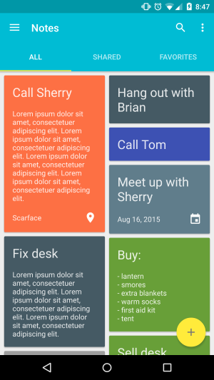
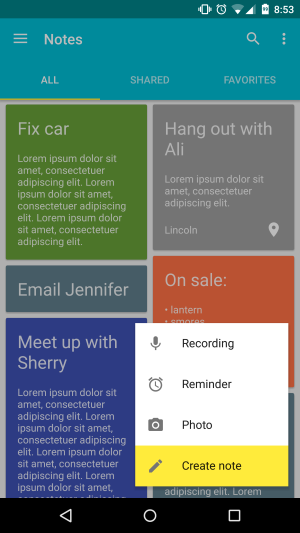

# MaterialSheetFab
[](https://oss.sonatype.org/content/repositories/releases/com/gordonwong/material-sheet-fab/)
[](https://www.codacy.com/app/gowong/material-sheet-fab)
[](https://raw.githubusercontent.com/gowong/material-sheet-fab/master/LICENSE)
[](https://android-arsenal.com/details/1/2178)
[](http://androidweekly.net/issues/issue-166)


Library that implements the floating action button to sheet [transition](https://www.google.com/design/spec/components/buttons-floating-action-button.html#buttons-floating-action-button-transitions) from Google's Material Design documentation. It can be used with any FAB library on Android 4.0+ (API levels >= 14).  


## Installation
### Gradle
Add the dependency (available from mavenCentral and jcenter) to your `build.gradle`:  
```groovy
implementation 'com.gordonwong:material-sheet-fab:1.2.1'
```

### Proguard
Modify your proguard configuration (if your app is using Proguard).
```java
-keep class io.codetail.animation.arcanimator.** { *; }
```

## Usage
### Implement the FAB:  
You can use any FAB library as long as it implements the `AnimatedFab` interface.  
```java
import android.support.design.widget.FloatingActionButton;

public class Fab extends FloatingActionButton implements AnimatedFab {

   /**
    * Shows the FAB.
    */
    @Override
    public void show() {
        show(0, 0);
    }

    /**
     * Shows the FAB and sets the FAB's translation.
     *
     * @param translationX translation X value
     * @param translationY translation Y value
     */
    @Override
    public void show(float translationX, float translationY) {
        // NOTE: Using the parameters is only needed if you want
        // to support moving the FAB around the screen.
        // NOTE: This immediately hides the FAB. An animation can 
        // be used instead - see the sample app.
        setVisibility(View.VISIBLE);
    }

    /**
     * Hides the FAB.
     */
    @Override
    public void hide() {
        // NOTE: This immediately hides the FAB. An animation can
        // be used instead - see the sample app.
        setVisibility(View.INVISIBLE);
    }
}
```

### Modify the layouts:  
```xml
<RelativeLayout
    android:layout_width="match_parent"
    android:layout_height="match_parent">

   <!-- Your FAB implementation -->
   <path.to.your.fab
        android:id="@+id/fab"
        android:layout_alignParentBottom="true"
        android:layout_alignParentEnd="true"
        android:layout_alignParentRight="true" />

    <!-- Overlay that dims the screen -->
    <com.gordonwong.materialsheetfab.DimOverlayFrameLayout
        android:id="@+id/overlay"
        android:layout_width="match_parent"
        android:layout_height="match_parent" />

    <!-- Circular reveal container for the sheet -->
    <io.codetail.widget.RevealLinearLayout
        android:layout_width="match_parent"
        android:layout_height="match_parent"
        android:gravity="end|bottom"
        android:orientation="vertical">

        <!-- Sheet that contains your items -->
        <android.support.v7.widget.CardView
            android:id="@+id/fab_sheet"
            android:layout_width="250dp"
            android:layout_height="300dp">
            
            <!-- TODO: Put your sheet items here -->
            
        </android.support.v7.widget.CardView>
    </io.codetail.widget.RevealLinearLayout>
</RelativeLayout>
```

### Initialize the MaterialSheetFab:  
This can be in your Activity or Fragment.  
```java
public class MaterialSheetFabActivity extends Activity {

    @Override
    public void onCreate(Bundle savedInstanceState) {
        super.onCreate(savedInstanceState);

        Fab fab = (Fab) findViewById(R.id.fab);
        View sheetView = findViewById(R.id.fab_sheet);
        View overlay = findViewById(R.id.dim_overlay);
        int sheetColor = getResources().getColor(R.color.fab_sheet_color);
        int fabColor = getResources().getColor(R.color.fab_color);

        // Initialize material sheet FAB
        materialSheetFab = new MaterialSheetFab<>(fab, sheetView, overlay,
            sheetColor, fabColor);
    }
}
```

### Optional:
**Close sheet on back button:**  
```java
@Override
public void onBackPressed() {
    if (materialSheetFab.isSheetVisible()) {
        materialSheetFab.hideSheet();
    } else {
        super.onBackPressed();
    }
}
```

**Listen to events:**  
```java
materialSheetFab.setEventListener(new MaterialSheetFabEventListener() {
    @Override
    public void onShowSheet() {
        // Called when the material sheet's "show" animation starts.
    }
    
    @Override
    public void onSheetShown() {
        // Called when the material sheet's "show" animation ends.
    }

    @Override
    public void onHideSheet() {
        // Called when the material sheet's "hide" animation starts.
    }
     
    public void onSheetHidden() {
        // Called when the material sheet's "hide" animation ends.
    }
});
```

**Move the FAB around the screen** (this is useful for coordinating with [snackbars](http://www.google.com/design/spec/components/snackbars-toasts.html)):  
```java
materialSheetFab.showFab(translationX, translationY);
```

## Sample app
[](https://play.google.com/store/apps/details?id=com.gordonwong.materialsheetfab.sample)

 

Take a look at the [sample code](./sample/) and try the [app](https://play.google.com/store/apps/details?id=com.gordonwong.materialsheetfab.sample).

## Apps using MaterialSheetFab
Feel free to open a pull request to include your app here.

Icon | App
 --- | ---
|[BG Monitor - Diabetes Management](http://bg-monitor.com/)

## Changelog
See changelog [here](./CHANGELOG.md).

## Credits
The following libraries are used:  
[CircularReveal](https://github.com/ozodrukh/CircularReveal) - Adds circular reveal animation on Android versions < 5.0  
[ArcAnimator](https://github.com/asyl/ArcAnimator) - Used to animate FAB in an arc

## License
```
The MIT License (MIT)

Copyright (c) 2015 Gordon Wong

Permission is hereby granted, free of charge, to any person obtaining a copy
of this software and associated documentation files (the "Software"), to deal
in the Software without restriction, including without limitation the rights
to use, copy, modify, merge, publish, distribute, sublicense, and/or sell
copies of the Software, and to permit persons to whom the Software is
furnished to do so, subject to the following conditions:

The above copyright notice and this permission notice shall be included in all
copies or substantial portions of the Software.

THE SOFTWARE IS PROVIDED "AS IS", WITHOUT WARRANTY OF ANY KIND, EXPRESS OR
IMPLIED, INCLUDING BUT NOT LIMITED TO THE WARRANTIES OF MERCHANTABILITY,
FITNESS FOR A PARTICULAR PURPOSE AND NONINFRINGEMENT. IN NO EVENT SHALL THE
AUTHORS OR COPYRIGHT HOLDERS BE LIABLE FOR ANY CLAIM, DAMAGES OR OTHER
LIABILITY, WHETHER IN AN ACTION OF CONTRACT, TORT OR OTHERWISE, ARISING FROM,
OUT OF OR IN CONNECTION WITH THE SOFTWARE OR THE USE OR OTHER DEALINGS IN THE
SOFTWARE.
```
